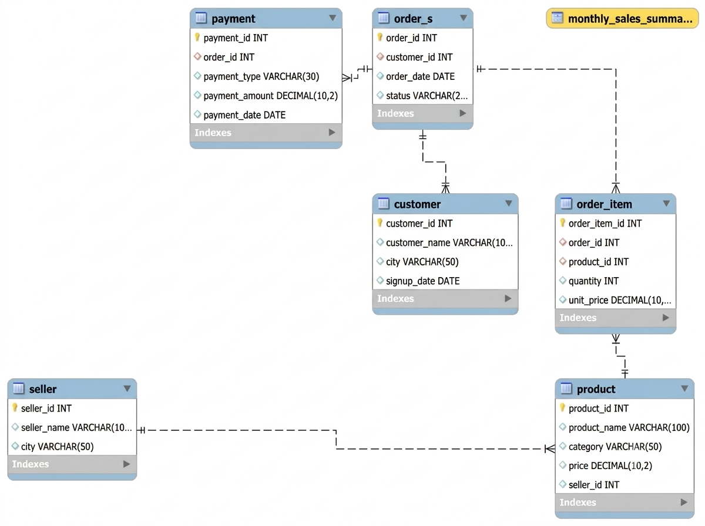

# SQL E-Commerce Project

This project is an E-Commerce database created using MySQL.

## Tools Used

- MySQL
- MySQL Workbench
- SQL

## Database Tables

- Customer
- Orders
- Order Items
- Product
- Seller
- Payment

## ER Diagram

## What I Learned

Through this project, I practiced creating tables, primary keys, foreign keys, and relationships between tables. I also practiced SQL queries, joins, aggregate functions, subqueries, and views.